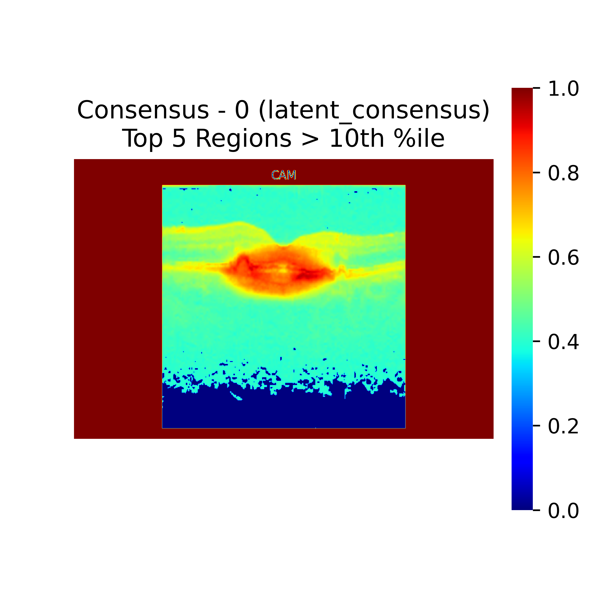

# CAS Toolbox

**Consensus Activation Score (CAS)** Toolbox is a utility for computing agreement metrics between activation heatmaps. It is especially useful in explainable AI (XAI) pipelines to quantify consistency across visual explanations produced by neural network models.

## Features

- Multiple CAS scoring strategies:
  - **mean**: Cosine similarity with the average heatmap
  - **union**: Cosine similarity with the union of heatmaps
  - **region_iou**: Intersection-over-Union (IoU) across thresholded regions
  - **ssim**: Pairwise Structural Similarity Index (SSIM)
  - **latent_consensus**: Latent space clustering with GMM and similarity-based consensus
- Supports `.npy`, `.png`, `.jpg`, and `.jpeg` heatmap formats
- Optionally saves consensus visualizations and latent t-SNE plots
- Handles invalid or missing latent vectors gracefully
- Designed to work with class-wise structured input directories


## Installation

Install the required dependencies with:

```bash
pip install numpy pillow scikit-image scikit-learn matplotlib

## Usage
from cas_toolbox.cas import compute_cas_for_dir

cas = compute_cas_for_dir(
    root_dir="LayerCAM-ResNet18-OCTID",             # Path to heatmap data organized by class
    strategy="ssim",                                # Options: mean, union, region_iou, ssim, latent_consensus
    threshold=0.2,                                   # Threshold for region_iou strategy
    save_vis_dir="Consensus_maps_LayerCam_ResNet18-OCTID",  # Output directory for visualizations
    latent_root="latent_vectors_ResNet18-C8"        # Required for 'latent_consensus' strategy
)

print("CAS Scores:")
for cls, score in cas.items():
    print(f"{cls}: {score:.4f}")

## Output
CAS Scores per class:
ClassA: 0.8421
ClassB: 0.7935
ClassC: 0.9112

## Visualisation
<p align="center">
  
</p>

## 📖 Citation
If you use this toolbox in your research or publications, please cite it as:

@misc{cas_toolbox,
author = {Abbas Haider et. al.},
title = {CAS Toolbox: A Tool for Computing Consensus Activation Scores from Heatmaps},
year = {2025},
howpublished = {\url{https://github.com/your-username/cas_toolbox}},
note = {Accessed: 2025-07-18}
}

Alternatively, you may reference it as:

> *CAS Toolbox (2025). A Python tool to compute agreement scores between class activation maps (CAMs) using strategies like mean consensus, SSIM, region IoU, and latent clustering. Available at: https://github.com/your-username/cas_toolbox*


